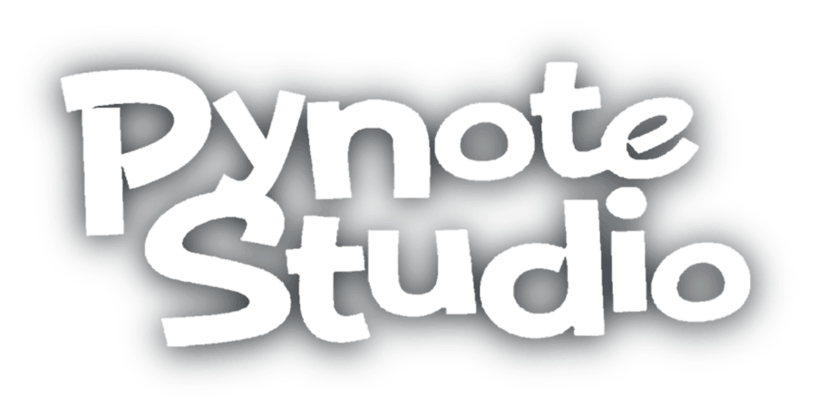

<p align="center">
    
    </p>
</p>

Pynote Studio is a Flipnote Studio recreation written in Python 3! This project allows you to create flipnotes on your computer!

## Table of Contents

- [Features](#features)
- [Requirements](#requirements)
- [Keyboard Shortcuts](#requirements)
- [Installation](#installation)
- [Usage](#usage)
- [License](#license)

## Features

- Create Flipnote animations on PC
- Export as MP4 (may be broken on Windows?)
- Save project and come back later

## Keyboard Shortcuts
```sh
I            -    Show Info Menu
B            -    Switch between Red and Blue
X            -    Erase current Page
< Arrow Key  -    Navigate Page Left
> Arrow Key  -    Navigate Page Right
Backspace    -    Delete current Page
CTRL + C     -    Copy current Page
CTRL + V     -    Paste current Page
CTRL + S     -    Save Project (as rawflipnote.rawppm)
CTRL + O     -    Open Project (from rawflipnote.rawppm)
CTRL + E     -    Export as MP4
```
<br>

## Requirements

- Python 3.6+
- ffmpeg
- The following Python packages:
  - pygame

## Installation

### Clone the Repository

First, clone the repository to your local machine:

```sh
git clone https://github.com/RekuNote/PynoteStudio.git
cd PynoteStudio
```

### Setting Up the Virtual Environment

It's recommended to use a virtual environment to manage dependencies:

```sh
python3 -m venv venv
source venv/bin/activate  # On Windows, use `venv\Scripts\activate`
```

### Installing Required Packages

Install the required packages using `pip`:

```pip install pygame```<br>

### Directory Structure

Ensure the directory structure is set up correctly:

```
PynoteStudio/
├── assets/
│   ├── font.otf
│   ├── blank.png
│   ├── blue.png
│   ├── delete.png
│   ├── erasebutton.png
│   ├── eraser.png
│   ├── frame_l.png
│   ├── frame_r.png
│   ├── pen.png
│   ├── play.png
│   ├── red.png
│   ├── splash_image.png
│   ├── stop.png
│   └── third_color_button.png
├── sound/
│   ├── BACK.wav
│   ├── BLOCK.wav
│   ├── COLOUR.wav
│   ├── COPYPAGE.wav
│   ├── DRAW.wav
│   ├── ERASE.wav
│   ├── FRAME_LEFT.wav
│   ├── FRAME_RIGHT.wav
│   ├── NEW_FRAME.wav
│   ├── OPEN.wav
│   ├── PASTEPAGE.wav
│   ├── PLAY.wav
│   ├── REMOVEPAGE.wav
│   ├── STOP.wav
│   └── TOOL.wav
└── main.py
```

## Usage

To start Pynote Studio, simply run `main.py`:

```sh
python3 main.py
```

This will start the application in a new window.

## License

Pynote Studio is licensed under the [GNU General Public License v3.0](https://www.gnu.org/licenses/gpl-3.0.html). You are free to use, modify, and distribute this software under the terms of the GPLv3.

